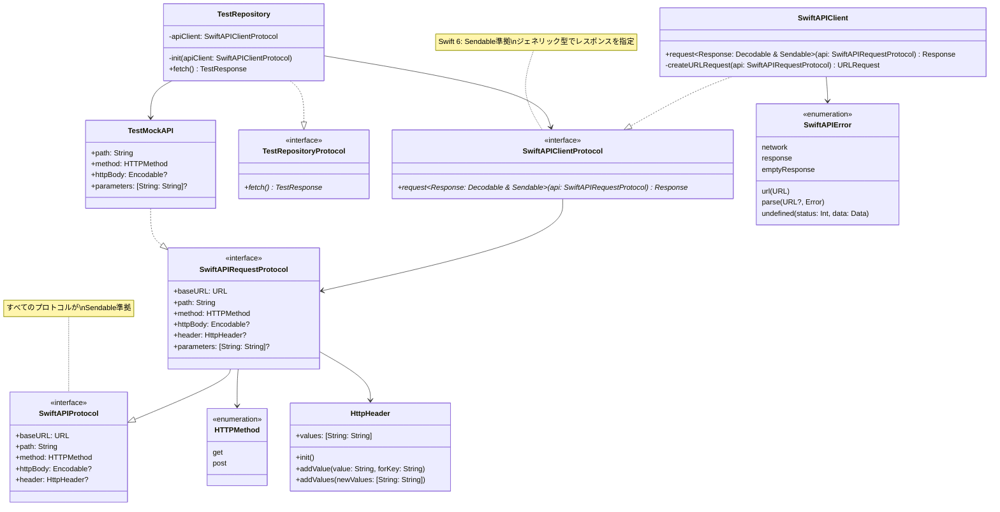

# SwiftAPIClient

**Swift 6完全対応のAPIクライアントライブラリ**

## 概要

- API通信の仕組みをモジュール化
- 外部モジュールとしてAPI関連の処理をまとめる
- Swift Concurrencyによる非同期処理の実現
- **Swift 6の並行処理安全性を確保（Sendable準拠）**
- URLSessionベースのシンプルな実装

## 主な特徴

- ✅ **Swift 6対応**: すべてのプロトコル・型がSendable準拠
- ✅ **プロトコルベース設計**: 依存性注入とテスタビリティを考慮
- ✅ **型安全**: ジェネリクスによる型安全なレスポンス処理
- ✅ **シンプル**: URLSessionのラッパーとして必要最小限の抽象化
- ✅ **async/await**: Swift Concurrencyによる直感的な非同期処理

## クラス図



## 使い方

### 1. APIリクエストの定義

`SwiftAPIRequestProtocol`を実装してAPIリクエストを定義します。

```swift
import SwiftAPIClient

// 共通の設定を持つプロトコルを定義（任意）
protocol YourAPI: SwiftAPIRequestProtocol {}

extension YourAPI {
    var baseURL: URL {
        URL(string: "https://api.example.com")!
    }
    var header: HttpHeader? {
        var header = HttpHeader()
        header.addValue("application/json", forKey: "Content-Type")
        return header
    }
}

// 具体的なAPIリクエスト
struct FetchUserAPI: YourAPI {
    let userId: String
    
    var path: String { "/users/\(userId)" }
    var method: HTTPMethod { .get }
    var httpBody: Encodable? { nil }
    var parameters: [String: String]? { nil }
}

struct CreatePostAPI: YourAPI {
    let title: String
    let body: String
    
    var path: String { "/posts" }
    var method: HTTPMethod { .post }
    var httpBody: Encodable? {
        CreatePostRequest(title: title, body: body)
    }
    var parameters: [String: String]? { nil }
}

// POSTリクエストのボディ
struct CreatePostRequest: Encodable {
    let title: String
    let body: String
}
```

### 2. レスポンスの定義

`Codable`と`Sendable`に準拠した構造体を定義します。

```swift
struct UserResponse: Codable, Sendable {
    let id: String
    let name: String
    let email: String
}

struct PostResponse: Codable, Sendable {
    let id: Int
    let title: String
    let body: String
    let userId: Int
}
```

### 3. Repositoryでの使用

```swift
protocol UserRepositoryProtocol {
    func fetchUser(userId: String) async throws -> UserResponse
    func createPost(title: String, body: String) async throws -> PostResponse
}

final class UserRepository: UserRepositoryProtocol {
    private let apiClient: SwiftAPIClientProtocol
    
    init(apiClient: SwiftAPIClientProtocol = SwiftAPIClient()) {
        self.apiClient = apiClient
    }
    
    func fetchUser(userId: String) async throws -> UserResponse {
        try await apiClient.request(FetchUserAPI(userId: userId))
    }
    
    func createPost(title: String, body: String) async throws -> PostResponse {
        try await apiClient.request(CreatePostAPI(title: title, body: body))
    }
}
```

### 4. ViewModelでの使用

```swift
import Observation

@MainActor
@Observable
final class UserViewModel {
    private(set) var user: UserResponse?
    private(set) var error: Error?
    
    private let repository: UserRepositoryProtocol
    
    init(repository: UserRepositoryProtocol = UserRepository()) {
        self.repository = repository
    }
    
    func loadUser(userId: String) async {
        do {
            user = try await repository.fetchUser(userId: userId)
        } catch {
            self.error = error
        }
    }
}
```

## APIの詳細

### SwiftAPIProtocol

すべてのAPIリクエストの基本となるプロトコル。

```swift
public protocol SwiftAPIProtocol: Sendable {
    var baseURL: URL { get }           // APIのベースURL
    var path: String { get }           // エンドポイントのパス
    var method: HTTPMethod { get }     // HTTPメソッド（GET/POST）
    var httpBody: Encodable? { get }   // リクエストボディ（POST用）
    var header: HttpHeader? { get }    // HTTPヘッダー（任意）
}
```

### SwiftAPIRequestProtocol

GETパラメータをサポートするプロトコル。

```swift
public protocol SwiftAPIRequestProtocol: SwiftAPIProtocol {
    var parameters: [String: String]? { get }  // GETクエリパラメータ
}
```

### SwiftAPIClientProtocol

APIクライアントのプロトコル。

```swift
public protocol SwiftAPIClientProtocol: Sendable {
    func request<Response: Decodable & Sendable>(
        _ api: SwiftAPIRequestProtocol
    ) async throws -> Response
}
```

**重要**: レスポンス型は`Decodable`と`Sendable`の両方に準拠する必要があります。

### HTTPMethod

サポートされているHTTPメソッド。

```swift
public enum HTTPMethod: String, Sendable {
    case get = "GET"
    case post = "POST"
}
```

### HttpHeader

HTTPヘッダーを管理する構造体。

```swift
public struct HttpHeader: Sendable {
    public private(set) var values: [String: String]
    
    public init()
    public mutating func addValue(_ value: String, forKey key: String)
    public mutating func addValues(_ newValues: [String: String])
}
```

### SwiftAPIError

APIエラーの列挙型。

```swift
public enum SwiftAPIError: Error, Sendable {
    case url(URL)                              // URL生成エラー
    case network                               // ネットワークエラー
    case response                              // レスポンス取得失敗
    case emptyResponse                         // レスポンスが空
    case parse(URL?, Error)                    // パースエラー
    case undefined(status: Int, data: Data)    // 未定義エラー（ステータスコード200-299以外）
}
```

## Swift 6対応のポイント

### Sendable準拠

すべてのプロトコル、構造体、列挙型が`Sendable`に準拠しています。これにより、Swift 6の並行処理安全性チェックに対応しています。

```swift
// すべてのプロトコルがSendable
public protocol SwiftAPIProtocol: Sendable { }
public protocol SwiftAPIClientProtocol: Sendable { }

// レスポンス型もSendable必須
struct UserResponse: Codable, Sendable { }
```

### ジェネリック型の設計

associatedtypeを使わず、メソッドのジェネリック型パラメータでレスポンスを指定します。

```swift
// ✅ 現在の設計（Swift 6対応）
func request<Response: Decodable & Sendable>(
    _ api: SwiftAPIRequestProtocol
) async throws -> Response

// ❌ 以前の設計（Swift 6非対応）
// protocol APIRequestProtocol {
//     associatedtype Response: Decodable
// }
// func request<T: APIRequestProtocol>(api: T) async throws -> T.Response
```

この設計により、以下のメリットがあります：
- Sendable制約を明示的に指定可能
- 型推論がシンプルになる
- プロトコルの実装が簡潔になる

## テスト

モックを使用したテストが容易です。

```swift
final class MockAPIClient: SwiftAPIClientProtocol {
    var mockResponse: Any?
    
    func request<Response: Decodable & Sendable>(
        _ api: SwiftAPIRequestProtocol
    ) async throws -> Response {
        guard let response = mockResponse as? Response else {
            throw SwiftAPIError.emptyResponse
        }
        return response
    }
}

// テストでの使用
let mock = MockAPIClient()
mock.mockResponse = UserResponse(id: "1", name: "Test", email: "test@example.com")
let repository = UserRepository(apiClient: mock)
let user = try await repository.fetchUser(userId: "1")
```

## ライセンス

MIT License

## 参考リンク

- [Swift 6の並行処理](https://docs.swift.org/swift-book/LanguageGuide/Concurrency.html)
- [Sendableプロトコル](https://developer.apple.com/documentation/swift/sendable)